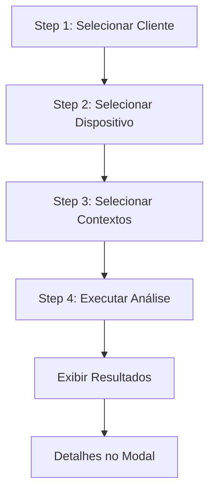

# Netbox_Sync — Frontend Contract

## 1. Contexto & Glossário (CONTEXT.md)

**Compliance Guiado**: Fluxo interativo em que um operador escolhe cliente, dispositivo e contextos de analise antes de executar verificacoes read-only.
**Candidato de Compliance**: Dispositivo ativo no NetBox elegivel para analise de compliance conforme filtros operacionais do projeto.
**Contexto de Analise**: Recorte funcional de compliance que determina qual fonte de evidencia sera consultada, como interfaces, BGP, seguranca, NTP/SNMP ou sysname.
**Coleta Read-only**: Obtencao de evidencias do dispositivo por SSH ou SNMP sem aplicar configuracao e sem escrita no NetBox.
**Job de Compliance**: Registro local de uma execucao controlada de compliance com gates, plano de coleta, artefatos coletados, parser e comparacao.
**Parser Local**: Processamento local dos artefatos coletados para produzir inventario estruturado antes da comparacao de compliance.

## 2. Estrutura de Dados de Findings

`ComplianceFinding` (TypedDict):
- `severity` (str): blocker | error | warning | info
- `context` (str): Contexto da análise (ex: bgp, interfaces, seguranca)
- `object` (str): Objeto afetado (Interface name, peer address, etc.)
- `message` (str): Mensagem legível do problema
- `details` (Dict[str, Any]): Detalhes técnicos, dicionário

Contextos Disponíveis:
- interfaces (SNMP)
- bgp (SSH)
- seguranca (SSH)
- nomenclaturas (SSH)
- ntp_snmp (SSH)
- sysname (SSH)

## 3. Endpoints (Resumo)
(Consultar API_CONTRACTS.md para detalhes)
- GET /compliance/eligible-tenants
- GET /compliance/eligible-devices?tenant_id=X
- GET /compliance/eligible-contexts
- POST /compliance/analyze-guided
- POST /compliance/analyze-file

## 4. UI Guidelines & Design Tokens
- **Background Principal**: #0B1020
- **Background Secundário**: #121A2F
- **Cards**: #172036
- **Hover**: #1E2945
- **Bordas**: rgba(255,255,255,0.05)
- **Status Cores**: 
  - Sucesso: #22C55E
  - Atenção: #F59E0B
  - Erro: #EF4444
  - Informação: #3B82F6
  - Destaque: #8B5CF6 (Lilás K3G)
- **Fonts**: Inter, Geist, ou SF Pro (Sem serifas).

## 5. Shape do State Frontend (JS)

```javascript
const state = {
  currentStep: 1, // 1 a 4
  analysisMode: 'netbox', // 'netbox' | 'file'
  selectedTenant: null, // { id, name }
  selectedDevice: null, // { id, name }
  selectedContexts: new Set(),
  findings: [],
  analysisResult: {},
  isAnalyzing: false,
};

// Funções Obrigatórias:
// goToStep(n)
// selectTenant(card)
// selectDevice(card)
// toggleContext(card)
// runAnalysis()
// selectMode(mode)
// runFileAnalysis()
```

## 6. Fluxo Visual



## 7. Changelog / Correções Aplicadas

### 2026-05-13
- **Bug Fix:** `DOMContentLoaded` em `compliance_guided.js` tinha acesso nulo em `input-api-url` e `input-api-key` — causava crash silencioso que impedia os event listeners do modal de serem registrados. Corrigido com guards `?` e `try/catch`.
- **Bug Fix:** `device-type-select` sem operador `?.` — proteção adicionada.
- **Feature:** Modal de escolha de modo agora tem botão `×` (`#mode-choice-close`) para fechar sem selecionar.
- **Feature:** Tecla `Esc` e clique no overlay fecham o modal de escolha de modo.
- **Feature:** Botão `⇄ Modo` no header permite reabrir o modal de escolha a qualquer momento.
- **Feature:** Modo Arquivo aceita `.txt`, `.csv` e `.json`; file picker abre automaticamente.
- **Design:** Sidebar simplificada — apenas Painel, Dispositivos e Compliance.
- **Design:** Findings exibidos como cards em grid (não mais tabela), com indicador colorido lateral por severidade.
- **Design:** Paleta de cores atualizada para padrão K3G (`#0B1020` bg, `#8B5CF6` primary lilás).
- **Design:** `closeModeChoice()` adicionada como função global para controle do modal.
